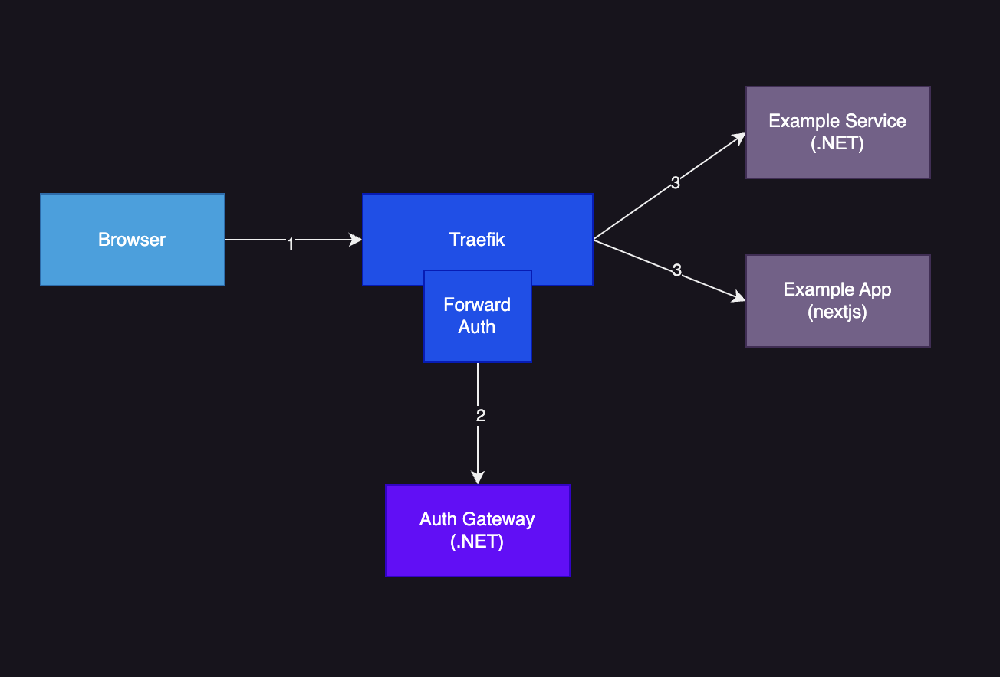
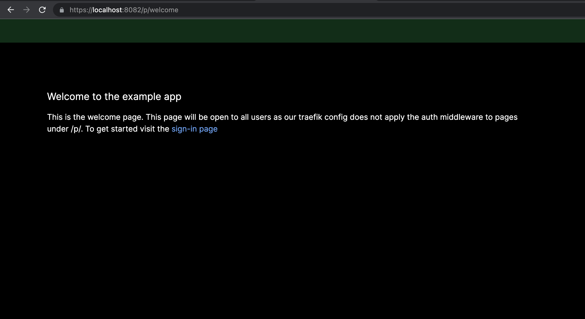
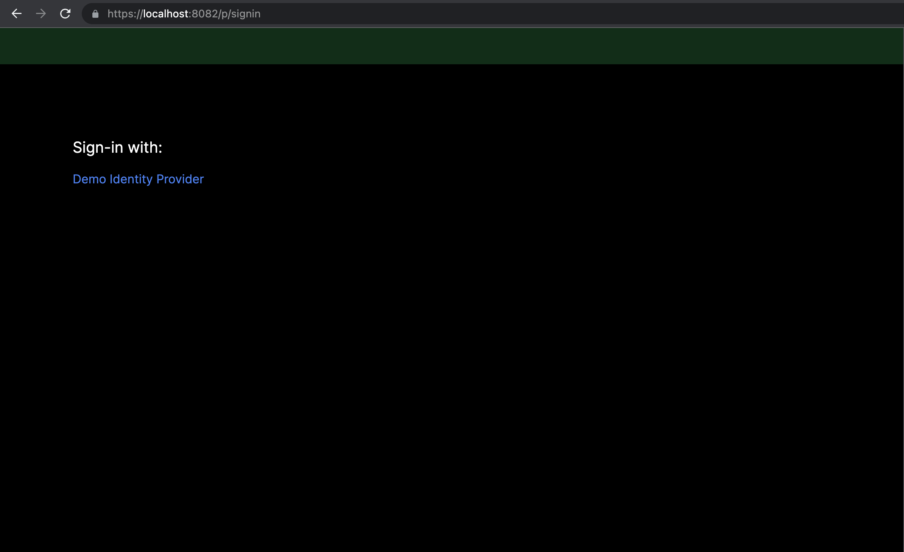
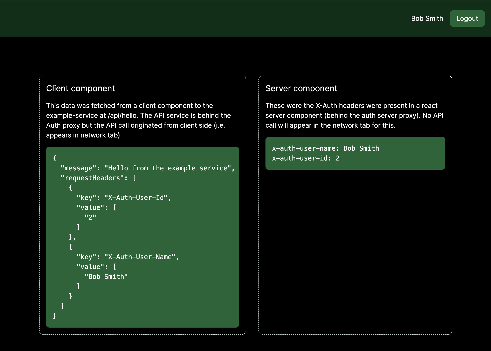

# Traefik ForwardAuth .NET Gateway Example

## Contents:

- [Introduction](#introduction)
- [Endpoints](#endpoints)
- [Example app](#example-app)
  - [Welcome Page (public)](#welcome-page-public)
  - [Signin Page (public)](#signin-page-public)
  - [Home Page (protected)](#home-page-protected)
- [Project Structure](#project-structure)
- [Running Locally](#running-locally)
- [Config](#config)
  - [1. CookieOptions](#1-cookieoptions)
    - [1.1 ClaimValueCheck](#11-claimvaluecheck)
  - [2. Providers](#2-providers)
    - [2.1 OpenIdOptions](#21-openidoptions)
    - [2.2 ClaimTransformationOptions](#22-claimtransformationoptions)
      - [2.3 ClaimTransformation](#23-claimtransformation)
  - [3. ClaimToHeaderMappings](#3-claimtoheadermappings)
  - [4. ClaimToUserInfoMappings](#4-claimtouserinfomappings)
  - [5. Optional Parameters](#5-optional-parameters)

## Introduction

A traefik forwardAuth gateway/service written in .NET. The purpose of this service is to hook into the traefik forwardAuth middleware and provide a session related endpoints for an app sitting behind traefik. The auth gateway performs session related checks and then forwards user related info as forward (`X-Auth-*`) headers to downstream services.

The topology of an app utilising a forwardAuth gateway might look something like the below:



In the image above the public request would first hit traefik. If the endpoint is configured to use forwardAuth middleware it will be passed onto our AuthGateway which will response with a 200, 401 or 302 depending on the session state. If the session is valid the request will be passed onto the downstream app with the user related info passed as `X-` headers.

There are similar solutions such as oauth2-proxy that utilise traefik forwardAuth or nginx request_auth, but I couldn't find anything existing that leverages .NET middleware. (see link section at bottom of README for similar solutions)

Notable TODO's:

- Refresh token rotation
- Redis session store
- TLS from traefik -> authgateway
- Authorization to downstream services

## Endpoints

The API surface of the authgateway is as follows:

| Endpoint                               | Description                                                                                                    |
| -------------------------------------- | -------------------------------------------------------------------------------------------------------------- |
| /oauth2/providers                      | A list of the configured Identity providers to be used by a signin page                                        |
| /oauth2/login/{providerName}           | Login endpoint to trigger an interactive signin for a specific provider                                        |
| /oauth2/signin-oidc/{providerName}     | Callback endpoint for a specific provider                                                                      |
| /oauth2/signout/{providerName}?sid=xxx | Signout endpoint for a provider. Note - Session ID should be passed for security purposes                      |
| /oauth2/signout-oidc/{providerName}    | Callback signout endpoint for a specific provider                                                              |
| /oauth2/user                           | User info endpoint - returns the properties for the current user (configured in ClaimToUserInfoMappings below) |
| /oauth2/check                          | Used internally by the traefik forwardAuth middleware to check if the user has a valid session                 |
| /oauth2/check/interactive              | Same as the check endpoint but will trigger an interactive login redirect if the session is not active         |

## Example app

The example app demonstrates how we can protect a Nextjs application as well as a .NET backend service using the auth gateway. In particular, it shows how we can decouple the auth config from the applications and consume them via the X-Auth headers.

The nextjs application is running on next 13.4 and demonstrates both client and server components.

## Welcome Page (public)

The welcome page demonstrates an example of a public page that is served without the auth proxy. This is useful for pages that don't require auth or user-specific context. This page also serves as the redirect page for users that attempt to access a protected page.



## Signin Page (public)

The sign-in page demonstrates an example of a page that consumes the auth proxy provider endpoint in a 'headless' fashion (see endpoints section in the main readme). In the screenshot we have a signle identity provider the user can click to login with.



## Home Page (protected)

The homepage demonstrates a protected route behind the auth proxy.

Some notable features:

- In the top right the userinfo is pulled from the UserInfo endpoint.
- The logout button redirects the user to the auth proxy for logout
- The 'client component' on the left demonstrates how we can call a downstream service - in this case the example-service. Despite the call originiating on the client-side the example-service was able to recieve the user info headers from the auth proxy (X-Auth-User-Id, X-Auth-User-Name)
- The 'server component' on the right demonstrates a nextjs server component, similarly as this is rendered on the server the app is able to read the X-Auth request headers.



## Project Structure

- `/local-dev/*`
  - `/local-dev/traefik` - contains the traefik config for running the app locally
  - `/local-dev/exampleapp` - a nextjs sample app with signin pages & interactive login
  - `/local-dev/example-service` - a .NET app running behind the auth gateway proxy
- `/src/*`
  - `/src/Authentication` - Contains the code for configuring AuthN middleware
  - `/src/Authorization` - Code for configuring claims principal and some very basic AuthZ related code
  - `/src/Endpoints` - Minimal API endpoints for the app (see endpoints below)
  - `/src/Exception`
  - `/src/Extensions`
  - `/src/Middleware`
  - `/src/Options` - Options models - see config section below

## Running Locally

Prequisites:

- Docker

Steps:

1. Create local dev certificates

We serve the app locally over https so traefik needs a validate certificate with the CN for localhost. Easiest way to do this is to output the dotnet dev certs to the ./local-dev/traefik/certs folder with the command below:

```sh
dotnet dev-certs https --trust --export-path ./local-dev/traefik/certs/dev-cert.pem --verbose --format PEM
```

2. Configure the app (see config section below)

You'll need an identity provider configured to use the auth_code flow. You can configure the app by providing the missing settings in ./local-dev/.env

3. Run the app

```sh
cd local-dev
./start.sh
```

4. Check containers are running

- `traefik` - app gateway
  - Dashboard accessible at `http://localhost:8082`
- `authserver` - The forwardAuth gateway
  - Accessible at `https://localhost:8082/oauth2/*`, see endpoints below for full detail,
- `exampleservice` - a basic .NET app that has a single endpoint
  - Accessible at: `https://localhost:8082/api/*`
- `exampleapp` - a nextjs app that has a few pages:
  - `https://localhost:8082/p/welcome` - public welcome page
  - `https://localhost:8082/p/signin` - public signin page
  - `https://localhost:8082/` - home page (protected by auth)

5. Making dev changes

- To run the AuthServer or the React app directly on the machine comment out the relevant lines in the `./local-dev/start.sh` script and then make the traefik routing changes in `./local-dev/traefik/conf/dynamic.yaml` to point to the service running on the host.

## Config

Below is the detailed configuration the authserver takes, all config keys are nested under the root key "ForwardAuth".

> Note: A kitchen sink config example can be found in [./src/appsettings.example.json](./src/appsettings.example.json)

### 1. CookieOptions

These options are used for the cookie signin scheme - so apply to all IDPs

| Key                      | Description                                                       | Type              |
| ------------------------ | ----------------------------------------------------------------- | ----------------- |
| CookieName               | The name of the cookie to use for signin                          | string            |
| SameSiteMode             | The SameSiteMode to use for the cookie                            | string            |
| ExpiryTimeSpan           | The expiry timespan for the cookie                                | string            |
| SlidingExpiration        | Whether the cookie should be sliding or not                       | bool              |
| RequiredClaimValueChecks | A list of claim value checks to apply to the cookie signin scheme | ClaimValueCheck[] |

#### 1.1 ClaimValueCheck

- Can be used to add basic AuthZ checks to the signin, if any claim checks fail the user signin will fail with an Unauthorized error

| Key        | Description              | Type   |
| ---------- | ------------------------ | ------ |
| ClaimType  | The claim type to check  | string |
| ClaimValue | The claim value to check | string |

### 2. Providers

- A list of Identity providers to use for signin

| Key                        | Description                                                                       | Type   |
| -------------------------- | --------------------------------------------------------------------------------- | ------ |
| Name                       | The name of the IDP                                                               | string |
| DisplayName                | The display name of the IDP                                                       | string |
| OptionalBaseReturnUrl      | Optional base url to use for when a redirectPath is passed to the login endpoints | string |
| OpenIdOptions              | The OpenIdConnect options to use for the IDP                                      | object |
| ClaimTransformationOptions | The claim transformation options to use for the IDP                               | object |

#### 2.1 OpenIdOptions

- These are the standard OpenIdConnect options that are passed to the Microsoft.AspNetCore.Authentication.OpenIdConnect package

| Key          | Description           | Type     |
| ------------ | --------------------- | -------- |
| Authority    | The IDP authority url | string   |
| ClientId     | The IDP client id     | string   |
| ClientSecret | The IDP client secret | string   |
| ResponseType | The IDP response type | string   |
| Scopes       | The IDP scopes        | string[] |
| UsePkce      | Whether to use PKCE   | bool     |

#### 2.2 ClaimTransformationOptions

- These options are used to transform the claims from the IDP into a consistent set of claims that can be used by the app

| Key             | Description                              | Type                  |
| --------------- | ---------------------------------------- | --------------------- |
| Transformations | A list of claim transformations to apply | ClaimTransformation[] |

##### 2.3 ClaimTransformation

| Key                | Description                      | Type   |
| ------------------ | -------------------------------- | ------ |
| ClaimType          | The claim type to transform      | string |
| ClaimValue         | The claim value to transform     | string |
| TransformationType | The transformation type to apply | string |

TransformationTypes:

| Key                  | Description                                                      | Type   |
| -------------------- | ---------------------------------------------------------------- | ------ |
| Map                  | Map the claim value to a new value                               | string |
| MapAndRemoveOriginal | Map the claim value to a new value and remove the original claim | string |
| Remove               | Remove the claim                                                 | string |

### 3. ClaimToHeaderMappings

- These options are used to map claims to headers that are passed to the downstream apps. Note - these transformations apply after those in the provider ClaimTransformations section, so the ones specified here should be the same for all IDP's whereas the ones above should be used to map each IDP to a consistent set of claims

| Key                | Description                              | Type                         |
| ------------------ | ---------------------------------------- | ---------------------------- |
| Mappings           | A list of claim mappings to apply        | `Dictionary<string, string>` |
| MissingClaimAction | The action to take if a claim is missing | "Throw" / "Ignore" / "Warn"  |

Note - Mapping key:values are in the format ClaimType:HeaderName

### 4. ClaimToUserInfoMappings

- These options are used to map the claims to the response object that will be presented on the userInfo endpoint (see endpoints section above). Note - these transformations apply after those in the provider ClaimTransformations section, so the ones specified here should be the same for all IDP's whereas the ones above should be used to map each IDP to a consistent set of claims

| Key                | Description                              | Type                         |
| ------------------ | ---------------------------------------- | ---------------------------- |
| Mappings           | A list of claim mappings to apply        | `Dictionary<string, string>` |
| MissingClaimAction | The action to take if a claim is missing | "Throw" / "Ignore" / "Warn"  |

Note - Mapping key:values are in the format ClaimType:UserInfoKey

### 5. Optional Parameters

| Key                                             | Description                                                            | Type   |
| ----------------------------------------------- | ---------------------------------------------------------------------- | ------ |
| OptionalDefaultProvider                         | The default provider to use if no provider is specified                | string |
| OptionalInteractiveChallengeRedirectOverrideUrl | An optional override url to use for the interactive challenge redirect | string |

## Further Reading & helpful links:

- Traefik forwardAuth docs
  - https://doc.traefik.io/traefik/middlewares/http/forwardauth/
- OAuth2 proxy
  - https://oauth2-proxy.github.io/oauth2-proxy/
  - A similar solution written in Go that is also compatible with traefik
- Vouch Proxy
  - https://github.com/vouch/vouch-proxy
  - A solution that uses nginx auth_request module to provide similar functionality as forwardAuth
- Duende BFF
  - https://docs.duendesoftware.com/identityserver/v6/bff/
  - Similar solution written in .NET but it uses YARP as its proxy solution instead of traefik. (Note: has commercial license)
